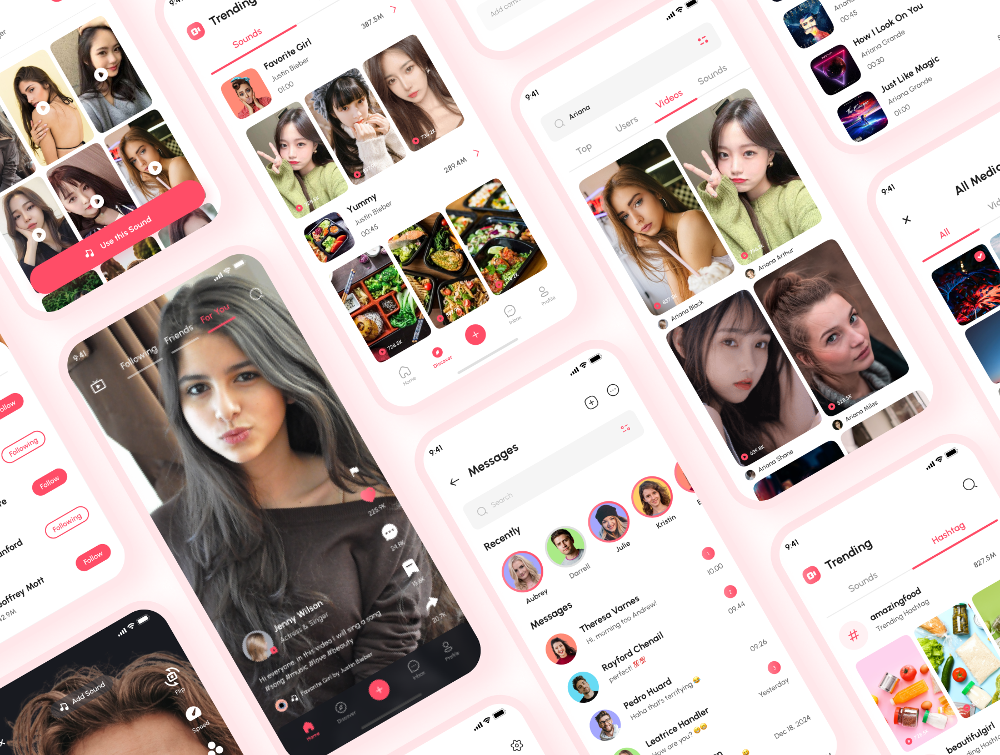

# Zuzu - Short Video & Social Media App - frontend

[Zuzu](https://zuzu-app.netlify.app/#/) is a Short Video, Live Streaming, Slideshow Maker, & Social Media App like TikTok, Instagram Reels, & YouTube Shorts. UI Kit by [figma-ui4free](https://figmaui4free.com/zuzu-short-video-social-media-app-ui-kit/)

## Table of contents

- [About](#about)
- [Getting Started](#getting_started)
- [Author](#author)

## About

I found a UI Kit in figma community that belongs to [Figma-ui4free](https://figmaui4free.com) and I decided to implement it using react, tailwindcss, and typescript. I want later to make this App functional by adding linking it to an API.. This UI kit (Zuzu) came with unique style and niche, that can be easily edited and customized. [Zuzu - Short Video & Social Media App UI Kit on figma](https://www.figma.com/community/file/1154400982888104016).

## Getting started

1. Clone the repo `git clone https://github.com/cs-fedy/zuzu-frontend`
2. Change your current directory to the repo dir: `cd zuzu-frontend`
3. Install all the dependencies: `yarn install`
4. Run the app in a dev env: `yarn run dev`

## Author:
**created at 🌙 with 💻 and ❤ by f0ody**
* **Fedi abdouli** - **zuzu** - [fedi abdouli](https://github.com/cs-fedy)
* my twitter account [FediAbdouli](https://www.twitter.com/FediAbdouli)
* my instagram account [f0odyy](https://www.instagram.com/f0odyy) 